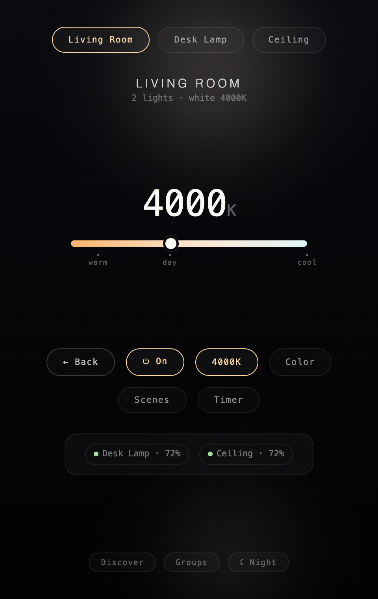
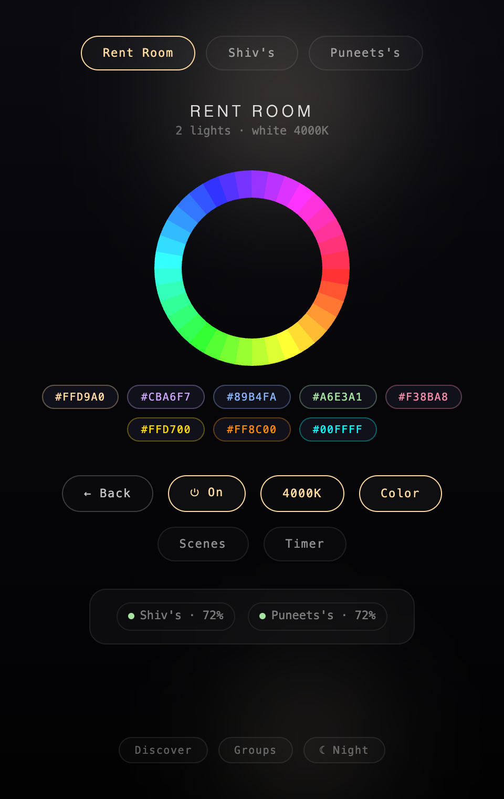
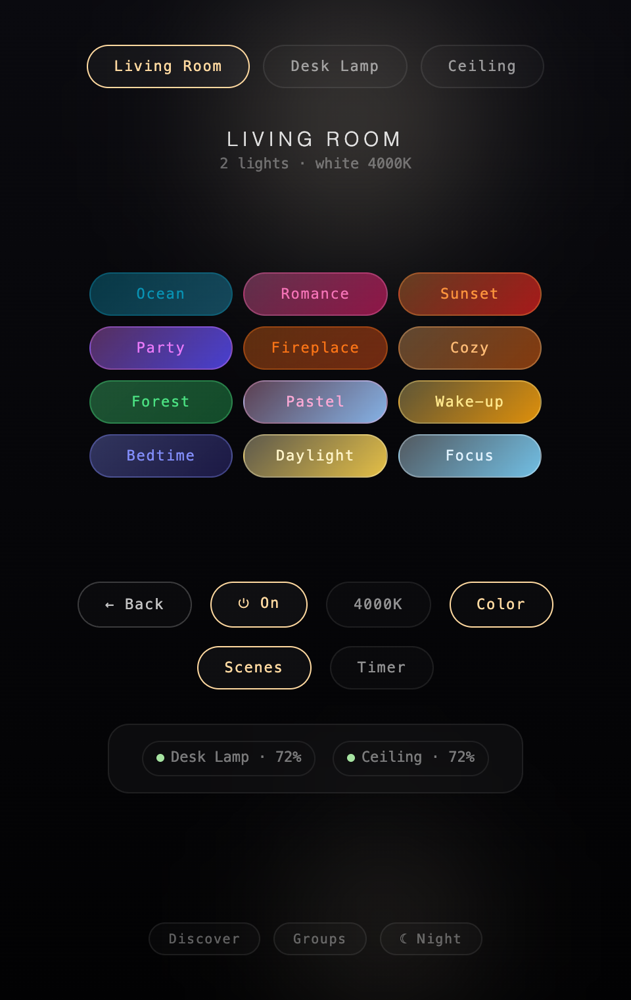
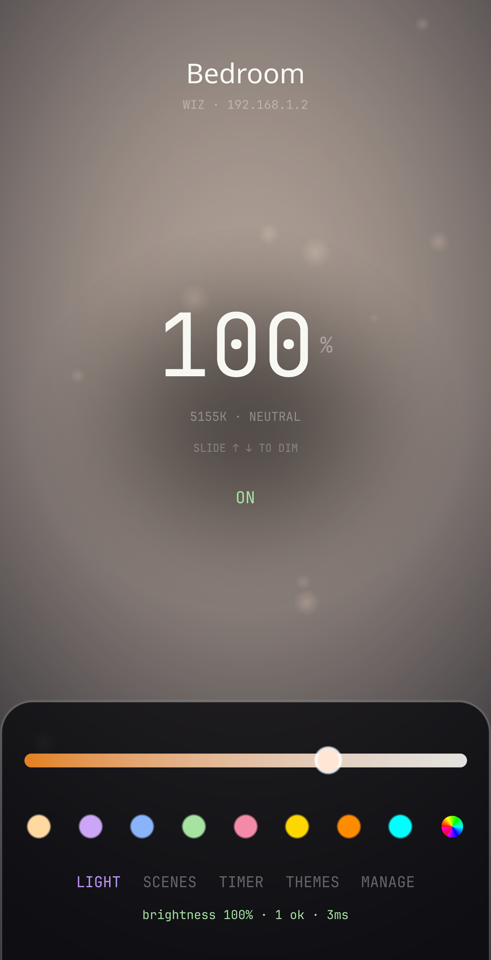
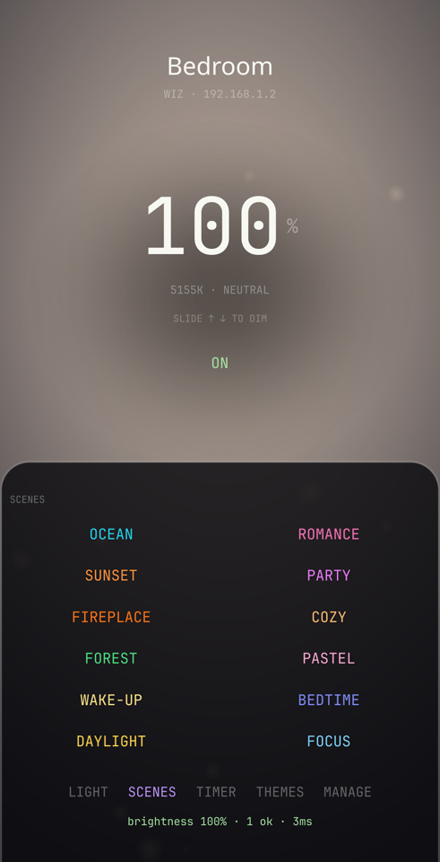
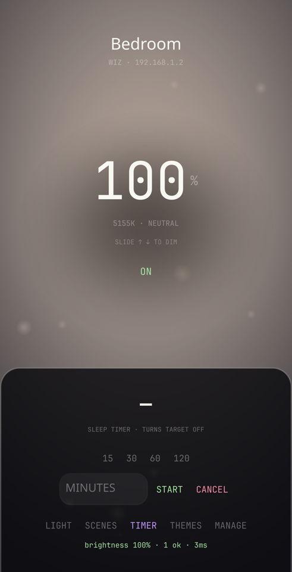

<div align="center">

# Lumina

**A desktop and Android app for WiZ smart lights.** The lamp is the interface — a glowing dial on desktop, a full-screen aura on mobile, both mirroring what your bulbs are actually doing.

[](https://github.com/shivarchit/Lumina/actions/workflows/ci.yml)
[](https://github.com/shivarchit/Lumina/releases/latest)
[](docs/install.md)
[](#license)

Built on the [Lumina-TUI](https://github.com/shivarchit/Lumina-TUI) engine — one engine, three faces.


</div>

## Install

**macOS / Linux**:

```bash
curl -fsSL https://raw.githubusercontent.com/shivarchit/Lumina/master/install.sh | bash
```

**Windows** (PowerShell):

```powershell
irm https://raw.githubusercontent.com/shivarchit/Lumina/master/install.ps1 | iex
```

**Android**: sideload `Lumina-android.apk` from the [latest release](https://github.com/shivarchit/Lumina/releases/latest) — where every desktop installer, zip, and tarball lives too.

On first run, **allow Local Network access** when macOS asks — the app talks to your bulbs directly over LAN UDP, no cloud. Toggles reporting *failed*? See [troubleshooting](docs/troubleshooting.md).

## Desktop

One oversized dial: click the arc, scroll to nudge, `Space` toggles power. Panels for temperature, color, and twelve WiZ scenes take the dial's place as needed. Leave it idle and the UI recedes into a lightpainting in your bulbs' current color.

| Temperature | Color | Scenes |
|-------------|-------|--------|
|  |  |  |

Live per-bulb status chips, discovery, groups with concurrent fan-out, sleep timer, and eight themes — every control detailed in [usage](docs/usage.md).

## Mobile — Aura

The phone app drops the dial: **the screen is the bulb**. A full-screen glow renders your light's live color and brightness, drag anywhere to dim, and every control is a word in the bottom sheet — kelvin slider, preset dots, a full-spectrum hue wheel, scenes, sleep timer with a hero countdown, themes, and device management.

| Light | Scenes | Timer |
|-------|--------|-------|
|  |  |  |

## Documentation

| Guide | What's inside |
|-------|---------------|
| [Usage](docs/usage.md) | Every desktop control — dial, keyboard, scenes, timer, groups, idle mode |
| [Themes](docs/themes.md) | The eight moods and how they sync across desktop, mobile, and TUI |
| [Install](docs/install.md) | Per-OS install, checksum verification, config location |
| [Build from source](docs/build.md) | Prerequisites, dev loop, release automation |
| [Troubleshooting](docs/troubleshooting.md) | Failed toggles, offline devices, discovery, macOS permission quirks |

## Architecture

The WiZ protocol, discovery, and config layers live in [`Lumina-TUI/pkg`](https://github.com/shivarchit/Lumina-TUI/tree/master/pkg); a shared `core/` package turns them into one engine consumed by both apps. Everything persists in `~/.lumina-config.json`, shared with the TUI.

- `core/` — platform-neutral engine: targets, fan-out, state sync, config
- `app.go` + `frontend/` — Wails desktop, vanilla JS/CSS
- `mobile/` — Fyne Android app (separate Go module)

## Development

```bash
wails dev                             # desktop live-reload
wails build                           # desktop production build
cd mobile && fyne package -os android # Android APK (needs NDK)
go test ./...                         # backend tests
```

Prereqs and per-OS setup in [docs/build.md](docs/build.md). Pushing a `v*` tag builds macOS, Windows, Linux, and Android artifacts and publishes a release with `SHA256SUMS.txt`.

## Related

- [Lumina-TUI](https://github.com/shivarchit/Lumina-TUI) — the terminal app and the engine this one is built on. Its CLI (`lumina on`, `lumina scene party`, …) pairs with cron for scheduling.

## License

MIT
