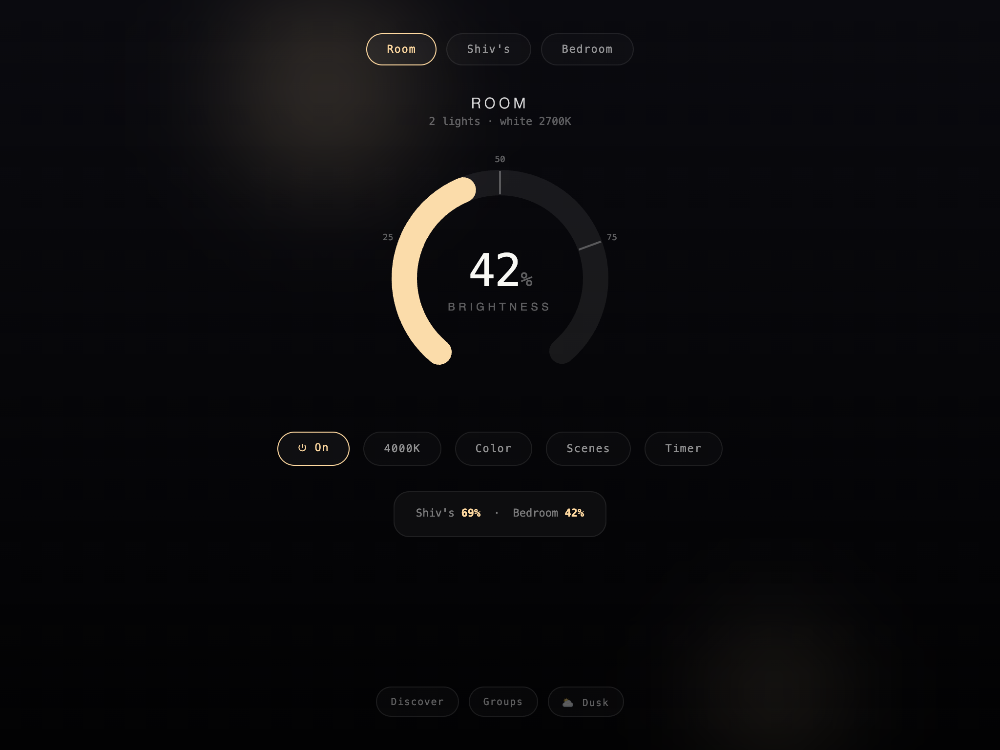
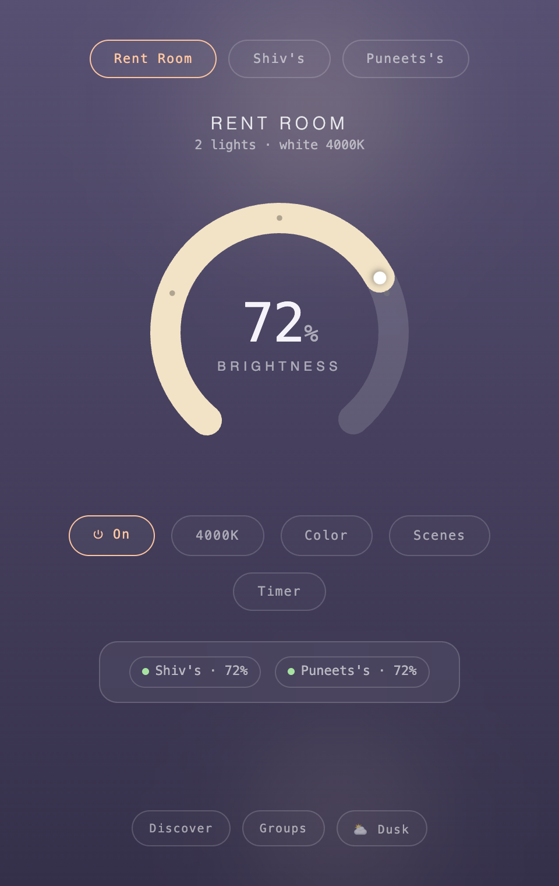

<div align="center">

# Lumina

**A desktop app for WiZ smart lights.** One oversized dial, frosted glass, and light blobs that mirror what your bulbs are actually doing. Click the ring, the room changes — the lamp is the interface.

[](https://github.com/shivarchit/Lumina/actions/workflows/ci.yml)
[](https://github.com/shivarchit/Lumina/releases/latest)
[](docs/install.md)
[](#license)

Built on the [Lumina-TUI](https://github.com/shivarchit/Lumina-TUI) engine — one engine, two faces.



</div>

## Install

**macOS / Linux**:

```bash
curl -fsSL https://raw.githubusercontent.com/shivarchit/Lumina/master/install.sh | bash
```

**Windows** (PowerShell):

```powershell
irm https://raw.githubusercontent.com/shivarchit/Lumina/master/install.ps1 | iex
```

Or grab the installer, portable zip, or tarball from the [latest release](https://github.com/shivarchit/Lumina/releases/latest).

On first run, **allow Local Network access** when macOS asks — the app talks to your bulbs directly over LAN UDP, no cloud. If toggles report *failed*, see [troubleshooting](docs/troubleshooting.md).

## Documentation

| Guide | What's inside |
|-------|---------------|
| [Install](docs/install.md) | Per-OS install, checksum verification, config location |
| [Build from source](docs/build.md) | Prerequisites per OS, dev loop, release automation |
| [Troubleshooting](docs/troubleshooting.md) | Failed toggles, offline devices, discovery issues |

## Features

- **One dial** — click anywhere on the arc or drag; an off bulb wakes at the clicked brightness
- **Targets** — pill switcher for saved devices and groups; group commands fan out concurrently with one aggregated result
- **Color / Temp / Scenes** — hue wheel with recent hexes, warm-to-cool kelvin rail, twelve WiZ scene presets with color-preview chips; each takes the dial's place (progressive disclosure), `← Back`/Esc returns
- **Sleep timer** — 15/30/60 presets or custom minutes, live countdown, cancel
- **Discover** — UDP broadcast scan; devices stream in as cards, save/rename inline
- **Groups** — create, delete, and tick members in a management overlay; targeting a group fans every command out
- **Live** — 10-second heartbeat re-syncs state, so changes from the phone app, the TUI, or cron show up here
- **Shared brain** — reads and writes the same `~/.lumina-config.json` as Lumina-TUI: devices, groups, theme, last state

## Night / Dusk

One toggle, same soul — ☾ near-black or ⛅ muted twilight.

| ☾ Night | ⛅ Dusk |
|---------|---------|
|  |  |

## Architecture

The WiZ protocol, discovery, and config layers live in [`Lumina-TUI/pkg`](https://github.com/shivarchit/Lumina-TUI/tree/master/pkg) and are imported as a Go dependency — engine fixes land there and reach this app with a version bump.

- `app.go` — Wails bindings: state fetch, fan-out control, discovery, device/group CRUD
- `frontend/` — vanilla JS + CSS, no framework; `src/main.js` and `src/style.css` are the whole UI
- `build/gen_icon.go` — stdlib generator for the Three Lights app icon

## Development

Requires Go 1.25+, Node 18+, and the [Wails CLI](https://wails.io/docs/gettingstarted/installation) — see [docs/build.md](docs/build.md) for per-OS setup:

```bash
wails dev      # live-reload development
wails build    # production build → build/bin/Lumina Desktop.app
go test ./...  # backend tests
```

Releases are automated: pushing a `v*` tag builds macOS (universal), Windows (amd64), and Linux (amd64/arm64) artifacts and publishes them with a combined `SHA256SUMS.txt`.

## Related

- [Lumina-TUI](https://github.com/shivarchit/Lumina-TUI) — the terminal app and the engine this one is built on. Its CLI (`lumina on`, `lumina scene party`, …) pairs with cron for scheduling.

## License

MIT
