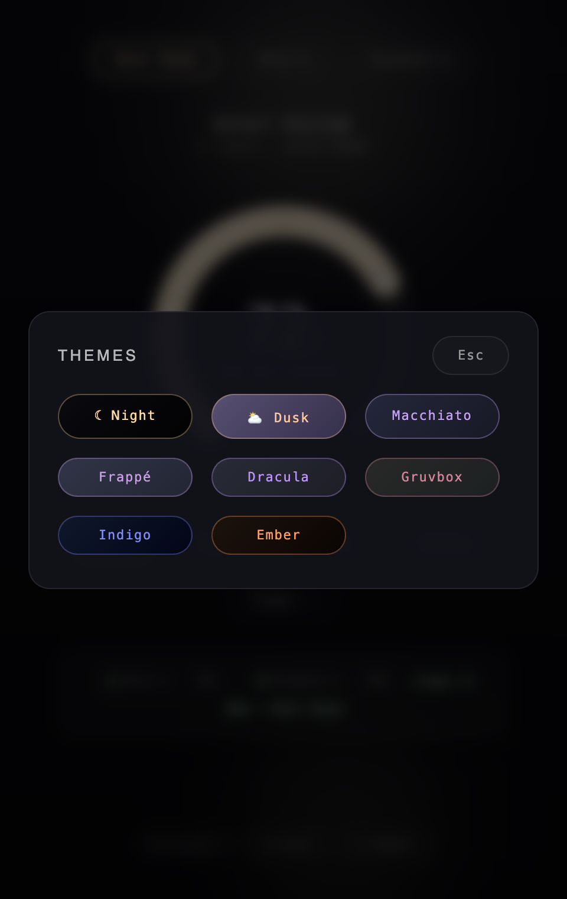

<div align="center">

# Lumina

**A desktop app for WiZ smart lights.** One oversized dial, frosted glass, and light blobs that mirror what your bulbs are actually doing. Click the ring, the room changes — the lamp is the interface.

[](https://github.com/shivarchit/Lumina/actions/workflows/ci.yml)
[](https://github.com/shivarchit/Lumina/releases/latest)
[](docs/install.md)
[](#license)

Built on the [Lumina-TUI](https://github.com/shivarchit/Lumina-TUI) engine — one engine, two faces.


</div>

## Install

**macOS / Linux**:

```bash
curl -fsSL https://raw.githubusercontent.com/shivarchit/Lumina/master/install.sh | bash
```

**Windows** (PowerShell):

```powershell
irm https://raw.githubusercontent.com/shivarchit/Lumina/master/install.ps1 | iex
```

Or grab the installer, portable zip, or tarball from the [latest release](https://github.com/shivarchit/Lumina/releases/latest).

On first run, **allow Local Network access** when macOS asks — the app talks to your bulbs directly over LAN UDP, no cloud. If toggles report *failed*, see [troubleshooting](docs/troubleshooting.md).

## Documentation

| Guide | What's inside |
|-------|---------------|
| [Usage](docs/usage.md) | Every control in detail — dial, keyboard, scenes, timer, groups, idle mode |
| [Themes](docs/themes.md) | The eight moods and how they sync with the TUI |
| [Install](docs/install.md) | Per-OS install, checksum verification, config location |
| [Build from source](docs/build.md) | Prerequisites per OS, dev loop, release automation |
| [Troubleshooting](docs/troubleshooting.md) | Failed toggles, offline devices, discovery, macOS permission quirks |

## The dial

Click anywhere on the arc or drag; scroll to nudge; arrow keys for precision (`⇧` for ±10, `Space` toggles power). Dots mark 25/50/75 and clicks near them snap; the knob rides the arc tip. An off bulb wakes at the clicked brightness.

## Panels

Each panel takes the dial's place — progressive disclosure, `← Back`/`Esc` returns.

| Temperature | Color | Scenes |
|-------------|-------|--------|
|  |  |  |

- **Temperature** — 2200K–6500K rail with warm / day / cool landmarks
- **Color** — hue ring plus recent and preset hexes
- **Scenes** — twelve WiZ presets with color-preview pills. While one plays, the Scenes pill morphs into a live indicator with an ✕ to stop it, visible from every screen:

<div align="center">


</div>

## Live status

One chip per bulb: **green** on · **red** off · **hollow** unreachable. Chips update the instant a command lands and re-sync from the bulbs every 10 seconds — changes from the phone app or TUI show up here too.

## Devices, groups, timer

| Discover | Groups | Timer |
|----------|--------|-------|
|  |  |  |

- **Discover** — UDP broadcast scan; bulbs stream in as cards, save/rename inline, offline saved devices stay editable
- **Groups** — tick members, target the group, commands fan out concurrently; deleting asks twice
- **Sleep timer** — presets or custom minutes, countdown with absolute end time

## Idle

Leave it alone for 45 seconds and the UI recedes — two light pools in your bulbs' current color roam the window. The app becomes a lamp, not a screen. Any input wakes it in 600ms.


## Themes

Eight moods — ☾ Night, ⛅ Dusk, Macchiato, Frappé, Dracula, Gruvbox, Indigo, Ember — shared with the TUI where names overlap. See [themes](docs/themes.md).

| ☾ Night | ⛅ Dusk | Picker |
|---------|--------|--------|
|  |  |  |

## Easter eggs

The dial knows certain numbers, and it's not just the dial. That's all the hint you get.

## Architecture

The WiZ protocol, discovery, and config layers live in [`Lumina-TUI/pkg`](https://github.com/shivarchit/Lumina-TUI/tree/master/pkg) and are imported as a Go dependency — engine fixes land there and reach this app with a version bump.

- `app.go` — Wails bindings: state fetch, fan-out control, discovery, device/group CRUD
- `frontend/` — vanilla JS + CSS, no framework; `src/main.js` and `src/style.css` are the whole UI
- `build/gen_icon.go` — stdlib generator for the Three Lights app icon

Everything persists in `~/.lumina-config.json`, shared with the TUI: devices, groups, theme, last state.

## Development

Requires Go 1.25+, Node 18+, and the [Wails CLI](https://wails.io/docs/gettingstarted/installation) — see [docs/build.md](docs/build.md) for per-OS setup:

```bash
wails dev      # live-reload development
wails build    # production build → build/bin/Lumina Desktop.app
go test ./...  # backend tests
```

Releases are automated: pushing a `v*` tag builds macOS (universal), Windows (amd64), and Linux (amd64/arm64) artifacts and publishes them with a combined `SHA256SUMS.txt`.

## Related

- [Lumina-TUI](https://github.com/shivarchit/Lumina-TUI) — the terminal app and the engine this one is built on. Its CLI (`lumina on`, `lumina scene party`, …) pairs with cron for scheduling.

## License

MIT
