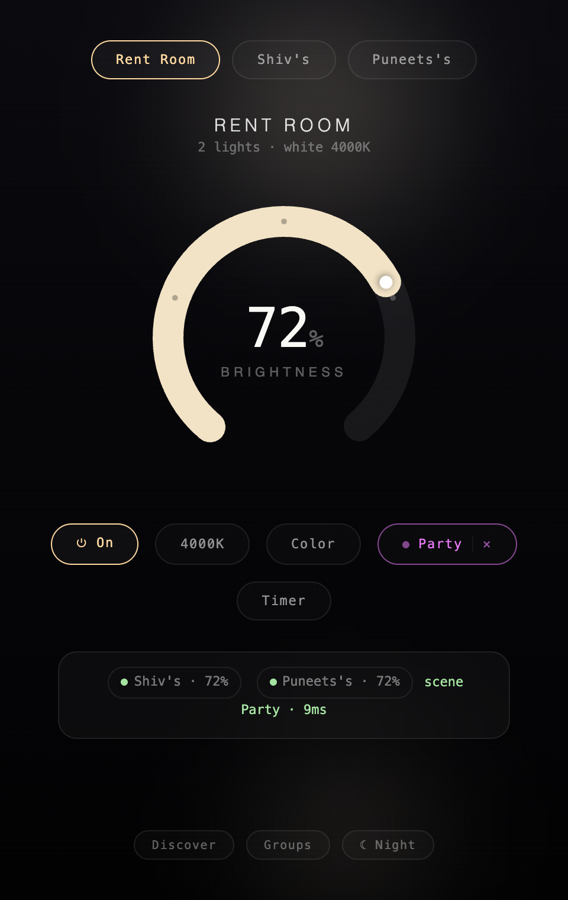
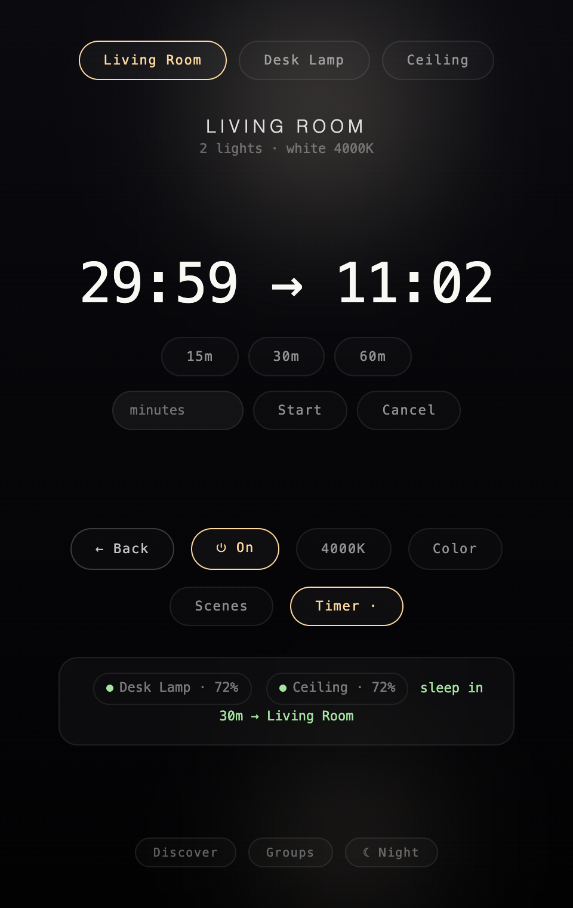
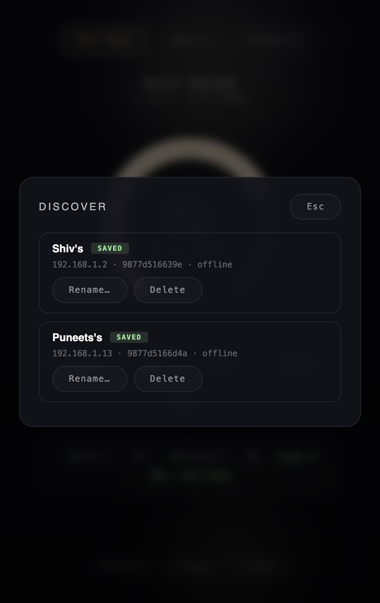
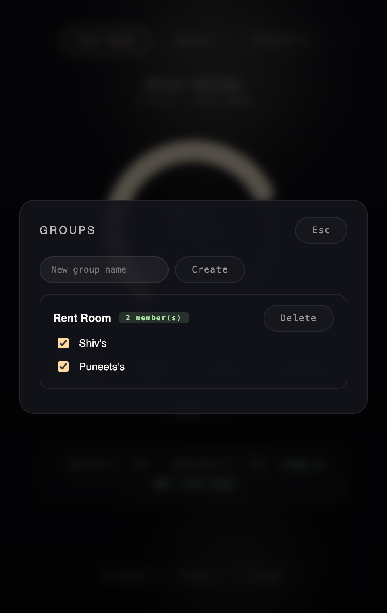
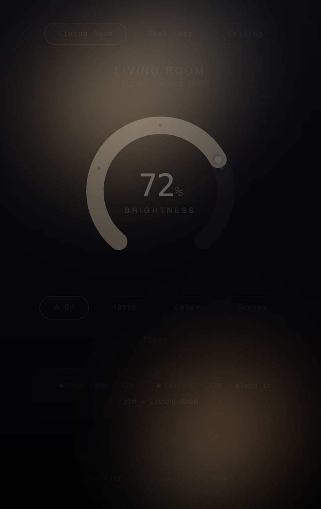

# Using Lumina Desktop

Every control in the app, in the order you meet it. Everything here works per
device or per group — pick the target first, the rest follows.

## Targets

The pill row at the top switches what you're controlling: groups first, then
saved devices. The name and summary under it always describe the active target
(`2 lights · white 4000K`). Commands sent to a group fan out to every member
concurrently and report one aggregated result in the status card.

## The dial

- **Click** anywhere on the arc to jump to that brightness. Clicks within ±2 of
  25 / 50 / 75 snap to the marker dot.
- **Drag** for precision — drags never snap.
- **Scroll** the mouse wheel over the dial to nudge ±2.
- The **white knob** rides the arc tip and marks the current level; the three
  dots punched into the track are the 25/50/75 landmarks.
- Setting any brightness on an off bulb **wakes it** at that level.

### Keyboard

| Key | Action |
|-----|--------|
| `←` / `→` | Brightness −1 / +1 |
| `⇧ ←` / `⇧ →` | Brightness −10 / +10 |
| `Space` | Toggle power |
| `Esc` | Close overlay, or collapse back to the dial |

## Color temperature

The `4000K` pill opens the kelvin rail: 2200K warm to 6500K cool, with
**warm / day / cool** landmarks at 2700 / 4000 / 6500. Setting a temperature
clears any color. The pill label always shows the current kelvin — even when
another app changes it.

## Color

The hue ring picks a color at full saturation; the row under it keeps your
last-used color plus preset hexes. Picking a color overrides temperature and
any running scene.

## Scenes

Twelve WiZ scene presets, each pill tinted with a preview of the scene's look.

While a scene plays, the **Scenes pill morphs into the scene indicator** —
scene color, pulsing live dot, and an `✕`:

- Click the **name** to open the scenes panel.
- Click **✕** to stop — bulbs have no scene-off command, so Lumina sends plain
  white at your current temperature and brightness, which overrides the scene
  program.

## Sleep timer

Presets (15/30/60 min) or custom minutes up to 12 hours. The countdown shows
the remaining time **and the absolute end time**. Cancel any time. The timer
lives in the app — quitting the app cancels it (use the TUI + cron for
detached schedules).

## Status card

At the bottom, one chip per device in the current target:

- **Green dot** — on, with current brightness
- **Red dot** — off
- **Hollow ring** — unreachable (offline / blocked)

Chips update the instant a command succeeds and re-sync from the bulbs every
10 seconds, so changes made from the phone app or the TUI appear here too.

## Discover & save devices

**Discover** broadcasts on the LAN and streams found bulbs in as cards —
save or rename them inline. Saved devices the scan can't reach still get a
card so they can be renamed or deleted while offline.

## Groups

Create a group, tick its members. Deleting takes **two taps** — the button
arms as *"sure? tap again"* for 3 seconds first. Deleting a device also
removes it from every group.

## Idle — lightpainting

Leave the app untouched for 45 seconds and the interface recedes: controls
fade out while two soft light pools in your bulbs' current color roam the
window — the app becomes a lamp, not a screen. Any input brings everything
back within 600ms. Disabled when your OS asks for reduced motion.

## Shared config

Everything is stored in `~/.lumina-config.json`, the same file
[Lumina-TUI](https://github.com/shivarchit/Lumina-TUI) reads and writes:
devices, groups, theme, and last color/brightness/temperature.

## And…

The dial knows certain numbers. The app knows what time it is. That's all the
hint you get.
